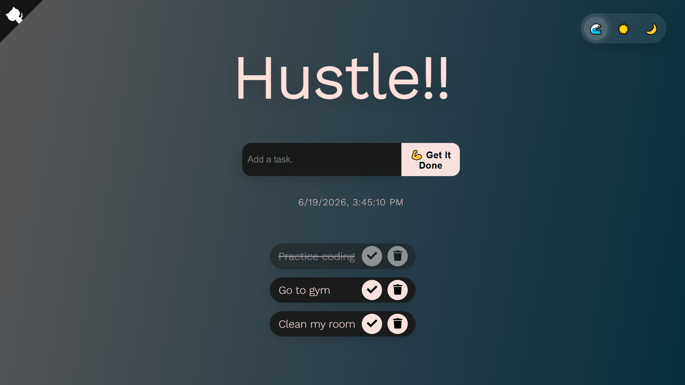
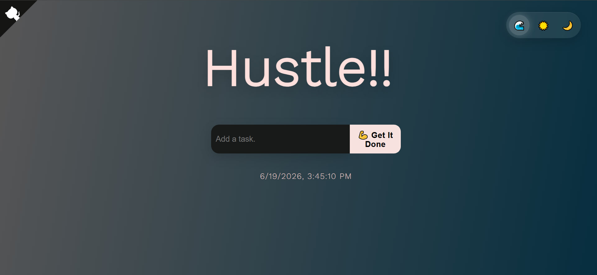
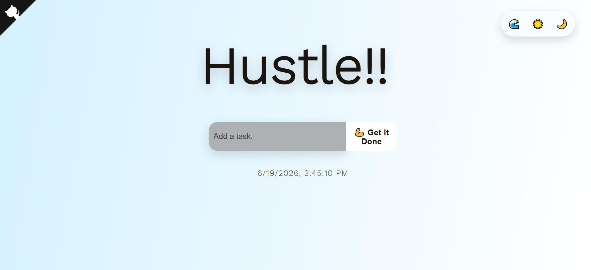
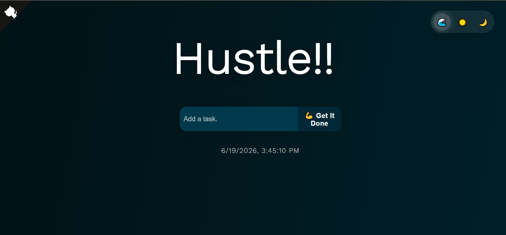

# Make It Happen! ✅

A lightweight and interactive To-Do List web app built with vanilla **HTML, CSS, and JavaScript**. Tasks are saved to the browser's local storage so they persist across sessions, and the app supports three switchable themes.

---

## 🚀 Features

- Add, complete, and delete tasks
- Tasks saved to **localStorage** — persists on page refresh
- **3 themes** — Standard 🌊, Light ☀️, Dark 🌙
- Theme preference saved and restored automatically
- Live date & time display
- Smooth delete animation
- Font Awesome icons for a clean UI

---

## 📸 Screenshots

### Home Page


### Task List


### Themes
| Standard 🌊 | Light ☀️ | Dark 🌙 |
|---|---|---|
|  |  |  |

---

## 🛠️ Tech Stack


---

## 📁 Project Structure

```
To-Do-List/
├── CSS/
│   ├── main.css        # Main styles & theme definitions
│   └── corner.css      # GitHub corner ribbon styles
├── JS/
│   ├── main.js         # Core app logic (add, delete, check, themes, localStorage)
│   └── time.js         # Live date & time display
├── assets/
│   └── favicon.png
├── screenshots/        # App screenshots for README
└── index.html          # App entry point
```

---

## ⚙️ Getting Started

No installations or dependencies needed!

1. Clone the repo:
   ```bash
   git clone https://github.com/DuDu21cs/To-Do-List.git
   ```
2. Open `index.html` in your browser

That's it — the app runs entirely in the browser. ✅

---

## 📫 Contact

**Duresa Chemeda**
- GitHub: [@DuDu21cs](https://github.com/DuDu21cs)
- Email: [duresachemedadudu@gmail.com](mailto:duresachemedadudu@gmail.com)
- LinkedIn: [Duresa Chemeda](https://www.linkedin.com/in/duresa-chemeda-66a28a411/)